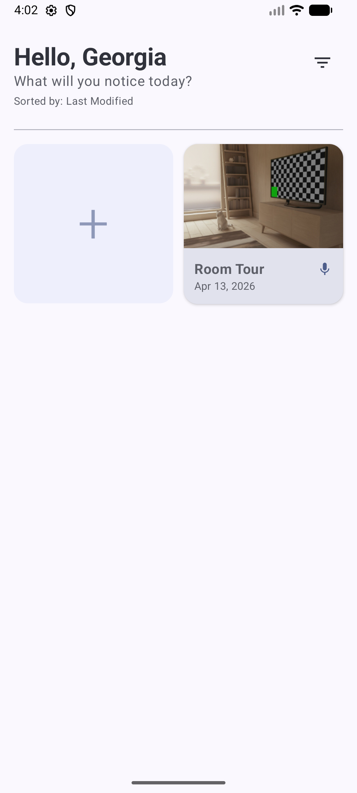
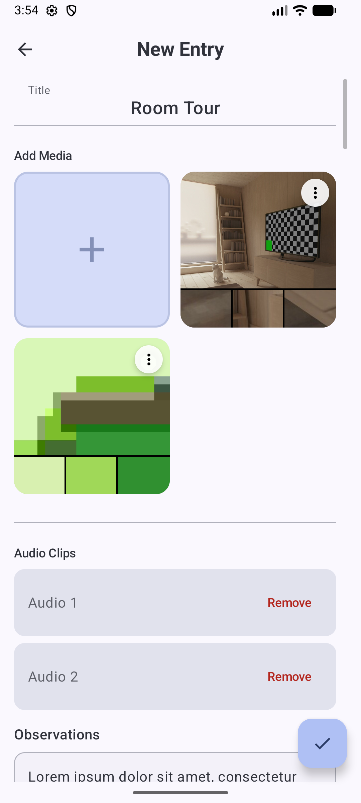
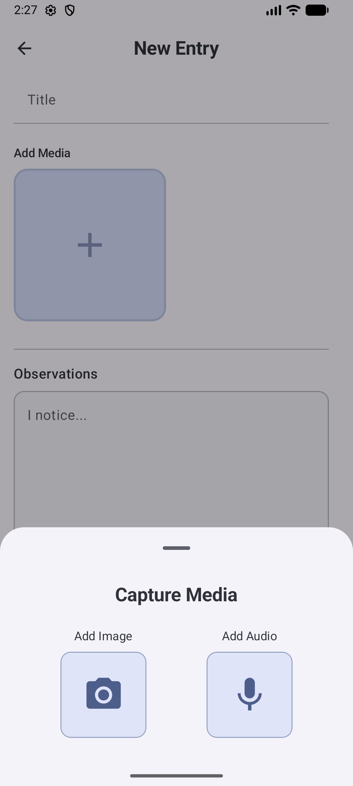
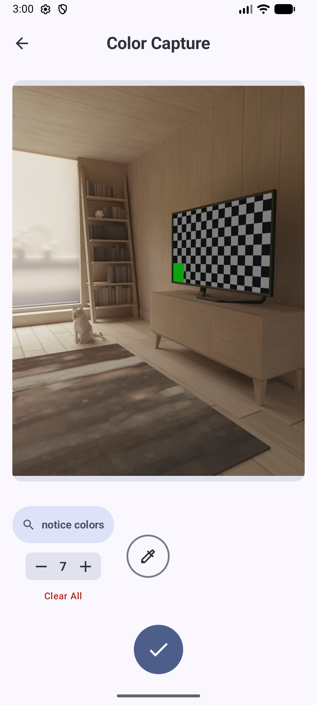
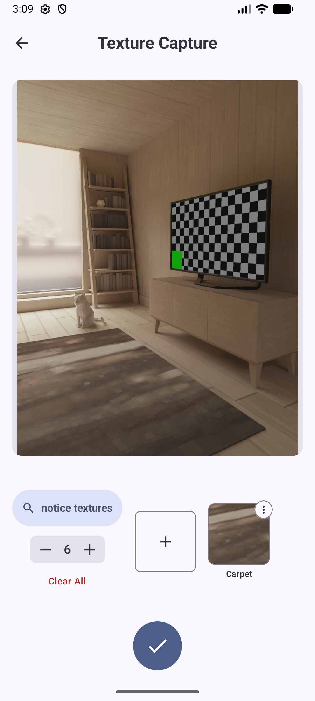
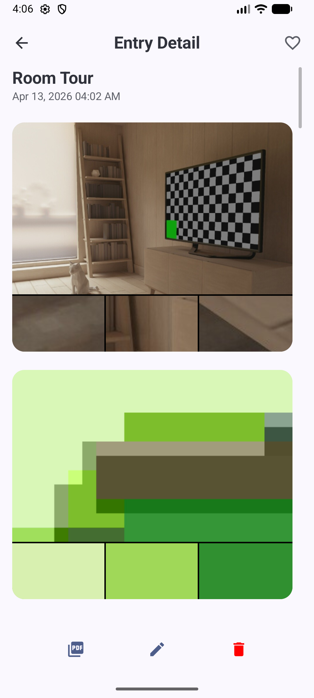
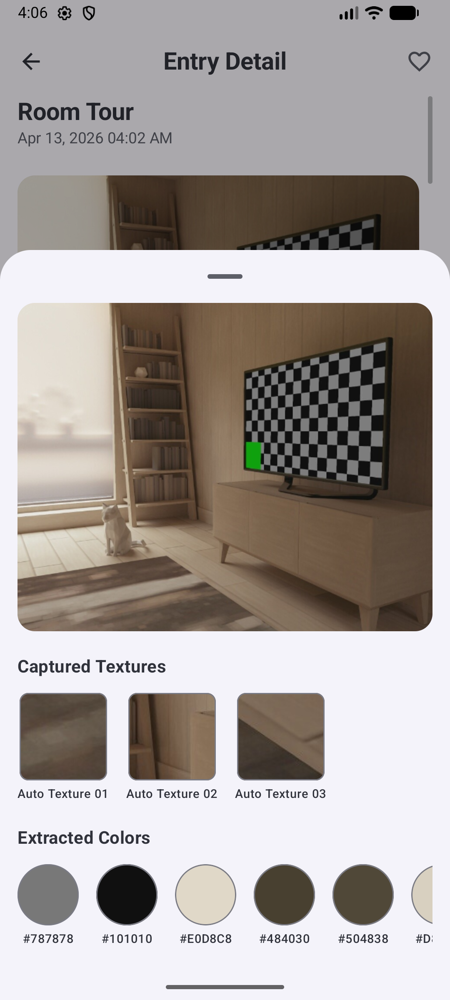
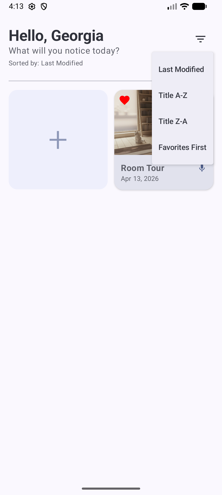
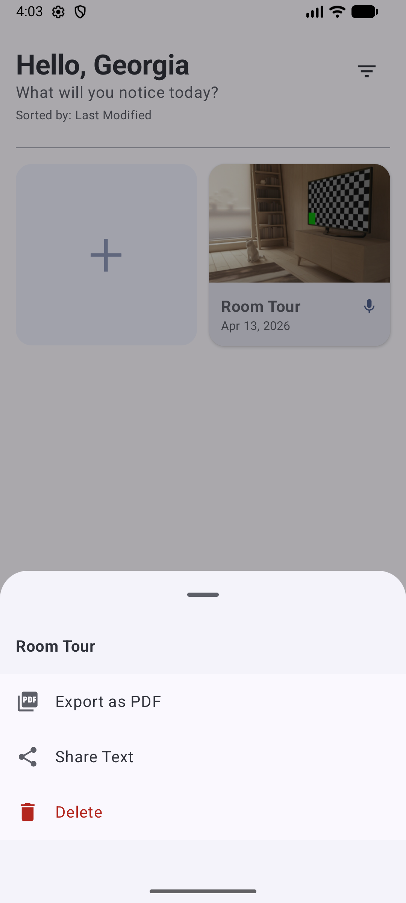

# NoticeArt

Final implementation of the **“Art of Noticing” (NoticeArt)** mobile application.

---

## Overview

NoticeArt is a mobile creative diary system designed to help users capture, organize, and revisit visual observations through multiple forms of media.

The application is built around the interaction model:

**Notice → Capture → Reflect → Save → Revisit**

Users create flexible entries that support images, colors, textures, and audio while maintaining strong data safety through a draft-based workflow.

---

## Problem

Creative observations are often lost because traditional tools (notes apps, camera apps) do not support structured capture of visual elements like colors, textures, and context together.

NoticeArt solves this by providing a **media-first system** that allows users to capture and organize visual inspiration in a single, consistent workflow.

---

## Key Features

- Draft-first entry system (prevents data loss)
- Multi-image support per entry (no overwrite)
- Per-image color extraction (manual + automatic)
- Texture capture and OpenCV-based detection
- Audio recording and playback support
- Edit-safe workflow (no accidental overwrites)
- Delete with undo recovery
- Entry filtering and favorites
- Export to structured PDF

---

## Setup Instructions

1. Clone the repository
2. Open the project in Android Studio
3. Sync Gradle
4. Run on emulator or physical device

**Recommended:** Android 11+ for best performance

---

## Screenshots

### Home Screen — Entry Preview Grid



---

### Entry Creation — New Draft



---

### Adding Media — Image Selection



---

### Color Capture — Eyedropper + Palette



---

### Texture Capture — Crop Interface



---

### Entry Detail — Full View



---

### Image Detail — Color & Texture Preview



---

### Filtering & Favorites



---

### Export to PDF



---

## User Flow 1 – Entry Creation + Media Capture

### Implementation includes:

- Draft-first entry creation system
- Title input with validation (required for publishing)
- Multi-image attachment (append-only, no overwrite)
- 2-column media grid with live preview
- Per-image media handling (no shared/global state)

---

### Color Capture & Suggestion System

#### Manual (Eyedropper)

- Tap-based pixel sampling
- Extracts exact HEX color from image
- Multiple colors per image
- Duplicate prevention
- Individual deletion supported

#### Automatic (Palette API)

- Uses Android Palette API
- Color clustering + frequency analysis
- Returns dominant colors (adjustable count)

**Behavior:**
- Ranked by population (pixel dominance)
- Balanced palette
- Slight variation from manual picks expected

---

### Texture Capture & Suggestion System

#### Manual Texture Crop

- Square crop (enforced)
- Drag + resize interaction
- Saved as user-defined texture

#### Automatic Texture Detection (OpenCV)

- Grayscale conversion
- Laplacian edge detection
- Variance scoring

**Detection Process:**

1. Image divided into grid regions
2. Regions scored by detail level
3. Spatial filtering prevents clustering
4. Top regions selected

---

### Media Behavior

- Media is confirmed → then locked
- Images cannot be replaced directly

Allowed actions:
- Remove media
- Extract colors
- Extract textures

---

## User Flow 2 – Entry Interaction (Edit, Delete, View)

### Implementation includes:

- Entry detail screen with:
  - Images
  - Color palettes
  - Texture previews
  - Observations
  - Audio

- Edit flow:
  - Entry → draft copy → update

- Change detection:
  - Prevents accidental loss
  - Shows discard dialog when needed

- Auto-save:
  - Lifecycle-aware
  - No duplicate entries

- Delete system:
  - Confirmation dialog
  - Undo via Snackbar

---

## Draft System

- Draft auto-created on “+”
- Persisted in Room
- Survives app restarts

### Safety Behavior

- Empty draft → auto-deleted
- Modified draft → discard confirmation
- Auto-save on interruption
- Draft restored on reopen

---

## Media System

### Image Support

- Multiple images per entry (`List<String>` URIs)
- Append-only (no overwrite)

### Data Integrity

- Colors and textures tied to source image
- No cross-image leakage
- Removing image removes associated data

---

## Audio System

- Record and attach audio to entries
- Playback supported in entry detail

**Limitations:**
- Single playback at a time
- Pause resets playback

---

## Additional Features

### Entry Filtering & Favorites

- Filter by:
  - Alphabetical
  - Favorites

- Favorite system:
  - Toggle heart icon
  - Prioritized filtering

---

## Architecture


```
UI (Jetpack Compose)
→ ViewModel (StateFlow)
→ Repository
→ Room Database
```

### Key Decisions

- Draft-first workflow
- Per-image media modeling
- State-driven UI
- Offline-first persistence
- Clear separation of concerns

---

## Tech Stack

- Kotlin
- Jetpack Compose
- ViewModel
- StateFlow
- Room Database
- Android Palette API
- OpenCV

---

## Current Status

**Final — Fully implemented, stable, and demo-ready**

### Completed

- Full entry lifecycle
- Draft system
- Multi-image support
- Per-image color system
- Texture detection + crop
- Audio integration
- Media grid with preview
- Entry filtering + favorites
- Export to PDF
- Data integrity guarantees

---

## Accepted Limitations

- Texture duplicates may occur
- Auto textures not editable
- Detection resets between sessions
- No cloud sync (offline-first)

---

## Team

- Leule Negatu
- Timothy Kim
- Sara Trufant
- Shirin Mohammadian

---

## Summary

NoticeArt is a fully implemented creative capture system that supports:

- Multi-modal media capture (images, colors, textures, audio)
- Intelligent color and texture suggestions
- Strong data safety through a draft-first workflow
- Consistent behavior across all screens

The system demonstrates a complete, stable, and user-safe workflow from capture to export.
